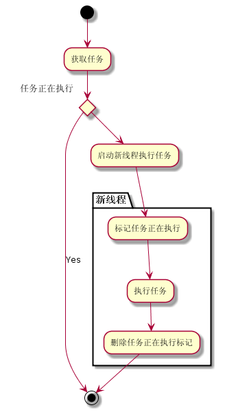

# 定时器 & 定时任务
Tephra提供了4个定时器，并分别定义了相应的定时任务接口，应用中只需实现相应的定时任务接口，便可在设置的时间点自动执行。定时器采用同一任务串行、不同任务并行的方式，确保任务可以快速、安全地执行。
- 并行——多个任务在相同的时间点执行时，每个任务独立使用一个线程并行执行，以确保任务可以在设置的时间点准时执行。
- 串行——相同的任务在同一个时间点只有一个实例会被执行，其他新加入的实例都会被取消，以降低资源争夺造成的数据风险。
- 线程池——通过线程池执行任务，降低系统资源的使用。



Tephra默认提供了DateScheduler、HourScheduler、MinuteScheduler、SecondsScheduler四个定时器，对应的分别定义了DateJob、HourJob、MinuteJob、SecondsJob四个定时任务。可修改core.tephra.config.properties配置项设置执行时机：
```properties
## 定时器执行实际设置
## 可设置为0 0 0 1 1 ?关闭定时器
## 每日定时器执行时机
#tephra.scheduler.date.cron = 30 30 4 * * ?
## 每小时定时器执行时机
#tephra.scheduler.hour.cron = 30 0 * * * ?
## 每分钟定时器执行时机
#tephra.scheduler.minute.cron = 0 * * * * ?
## 每秒钟定时器执行时机
#tephra.scheduler.seconds.cron = * * * * * ?
```
## 自定义定时器
自定义定时器时，只需在方法上定义Scheduled注解即可，可参考DateScheduler实现：
```java
package org.lpw.tephra.scheduler;

import org.springframework.beans.factory.annotation.Autowired;
import org.springframework.scheduling.annotation.Scheduled;
import org.springframework.stereotype.Component;

import java.util.Set;

/**
 * @author lpw
 */
@Component("tephra.scheduler.date")
public class DateSchedulerImpl extends SchedulerSupport<DateJob> implements DateScheduler {
    @Autowired(required = false)
    protected Set<DateJob> jobs;

    @Scheduled(cron = "${tephra.scheduler.date.cron:30 30 4 * * ?}")
    @Override
    public synchronized void execute() {
        if (validator.isEmpty(jobs))
            return;

        if (logger.isDebugEnable())
            logger.debug("开始执行每日定时器调度。。。");

        jobs.forEach(this::pool);

        if (logger.isDebugEnable())
            logger.debug("成功执行{}个每日定时器任务！", jobs.size());
    }

    @Override
    public void execute(DateJob job) {
        job.executeDateJob();
    }
}
```
## SchedulerJobListener
```java
package org.lpw.tephra.scheduler;

/**
 * 定时器任务监听器。用于监听定时器任务执行事件。
 *
 * @author lpw
 */
public interface SchedulerJobListener {
    /**
     * 开始执行定时器任务。
     */
    void begin();

    /**
     * 执行定时任务时发生异常。
     *
     * @param throwable 异常信息。
     */
    void exception(Throwable throwable);

    /**
     * 定时器任务执行完毕。
     */
    void finish();
}
```
任意实现了SchedulerJobListener接口的实现，在任务开始、结束、异常时，都会得到通知。

tephra-dao模块默认实现了SchedulerJobListener接口，因此在定时任务执行结束时会自动提交事务并关闭连接，而执行发生异常时自动回滚并关闭连接。

## 使用SchedulerHelper
SchedulerHelper允许动态指定执行时机：
```java
package org.lpw.tephra.scheduler;

import java.util.Date;

/**
 * 定时任务支持。
 *
 * @auth lpw
 */
public interface SchedulerHelper {
    /**
     * 延迟执行任务。
     *
     * @param job  任务。
     * @param time 延迟时间，单位：毫秒。
     */
    void delay(SchedulerJob job, long time);

    /**
     * 指定时间执行任务。
     *
     * @param job  任务。
     * @param time 执行时间。
     */
    void at(SchedulerJob job, Date time);
}
```
需提供SchedulerJob实现：
```java
package org.lpw.tephra.scheduler;

/**
 * 定时任务。
 *
 * @auth lpw
 */
public interface SchedulerJob {
    /**
     * 获取定时任务名称。
     *
     * @return 定时任务名称。
     */
    String getSchedulerName();

    /**
     * 执行定时任务。
     */
    void executeSchedulerJob();
}
```
