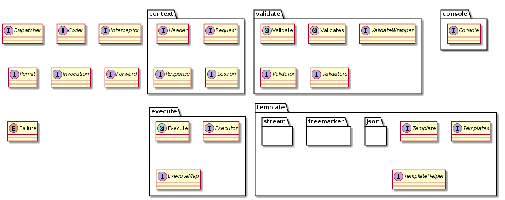

# Ctrl简介
Ctrl模块提供控制器分发功能，但并未使用第三方控制器组件，主要基于以下几个原因的考虑：
- 当前主流的开源控制器大多存在着安全漏洞，虽然可以通过增加过滤器来规避，但对于一些对安全性要求比较高的系统或合作方，仍旧无法接受。
- Tephra一开始的目标是为游戏服务端构建基于JavaEE的开发框架，高效、低损耗成为重要目标，而第三方组件为了兼容各种应用场景，必须牺牲部分CPU时间。
- 控制器不仅需要支持HTTP协议，也希望能支持自定义的Socket协议，而目前主流的第三方控制器大多只支持HTTP协议。

Ctrl模块参考了Struts2和Spring MVC的设计，具有以下几个特点：

- 通过注解配置请求处理接口，提高配置的可读性，为模块化开发提供良好支持。
- 使用单例模式定义处理接口类，提高执行效率，降低执行损耗。
- 通过注解配置参数验证规则，提供了部分常用验证规则，并且可以轻易地扩展验证规则。
- 提供拦截器接口，方便对请求进行拦截处理。
- 提供加解密接口，实现该接口便可自动对请求进行加解密操作。
- 提供权限验证接口，实现该接口便可对请求进行自定义的权限验证。
- 支持多输出格式，并且可以方便地扩展输出格式，或替换现有输出格式。
- 控制大量并发请求，当并发请求达到设置峰值时，自动屏蔽新的请求，以保护服务。
- 允许运行器执行控制指令，可以执行任意Bean的任意函数，可对请求端设置认证密钥及访问IP白名单，默认处于关闭状态以策安全。

Ctrl接口图：

[使用Execute注解定义服务](doc/execute.md)

[输出与模板](doc/template.md)

[自动事务控制](doc/transaction.md)

[使用拦截器](doc/interceptor.md)

[请求参数验证](doc/validate.md)

[IP白名单](doc/trustful-ip.md)

[请求参数签名](doc/sign.md)

[权限验证](doc/permit.md)

[服务跳转与页面转发](doc/forward.md)

[验证错误编码管理](doc/failure-code.md)

[导出Excel](doc/excel.md)

[配置参数](src/main/resources/ctrl.tephra.config)
